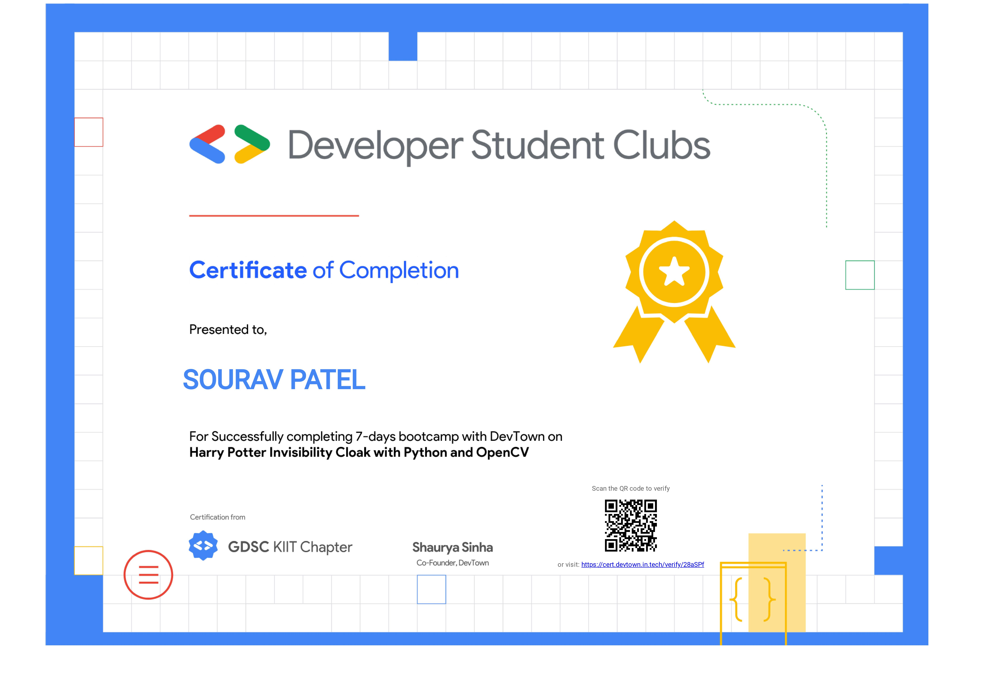

# Harry Potter's Invisible Cloak Project

This project aims to recreate the magical effect of Harry Potter's Invisible Cloak using OpenCV and Python. By leveraging computer vision techniques, the application will make a selected color (typically green or blue) appear transparent, creating the illusion of invisibility.

## Tools and Technologies Used

- Python: The programming language used for implementing the project.
- OpenCV: A popular computer vision library for image and video processing.
- Webcam or Camera: To capture the live video feed for processing.
- Development Environment: Choose any preferred Python IDE or code editor.

## Process

1. **Background Capture:** Capture the background image without any objects or persons that you want to make invisible. This image will serve as a reference for masking.

2. **Color Segmentation:** Convert the video feed into the HSV color space and apply color segmentation techniques to detect the specific color range of the cloak. Create a binary mask where the detected color appears as white.

3. **Morphological Operations:** Clean up the binary mask using morphological operations like dilation and erosion to remove any noise and improve the quality of the mask.

4. **Object Masking:** Apply the binary mask to the current video frame, where the detected color (cloak) appears as white and the rest as black. This step isolates the cloak region.

5. **Combine Frames:** Combine the masked video frame with the background reference image using bitwise operations to overlay the cloak region from the current frame onto the background image.

6. **Display Output:** Display the final output frame where the cloak appears transparent, creating the illusion of invisibility.

## Usage

1. Clone the project repository: `git clone https://github.com/tonystark5683/Invisible-Cloak.git`

2. Install the necessary dependencies: `pip install opencv-python`

3. Run the project script: `python invisible_cloak.py`

4. Follow the on-screen instructions to start the invisibility effect and press 'Q' to exit.

## Credits

This project was inspired by the famous Harry Potter series and is created as a learning exercise in computer vision using OpenCV and Python.

## Certificate

